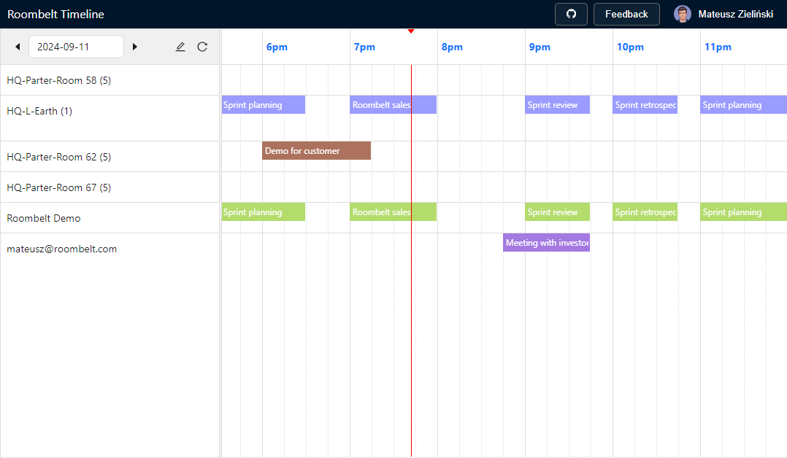

This is the source code of the free app presenting events from multiple calendars in Google Calendar and Microsoft 365 on a convenient timeline view.

This is provided to you by Mateusz Zieliński from roombelt.com. If you like this project consider trying Roombelt, too!

## License

The source code is licensed under the GPL v3.0 license.
